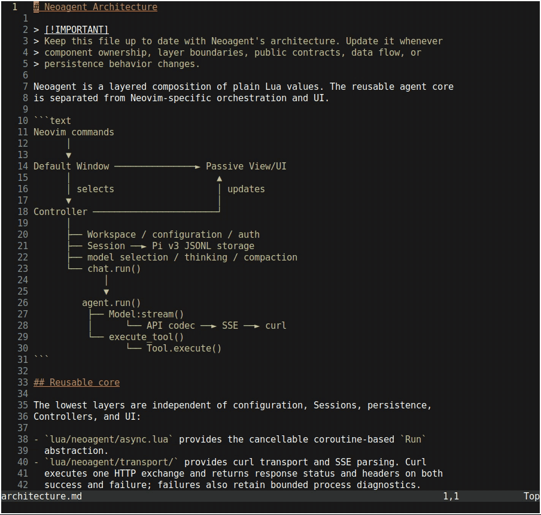
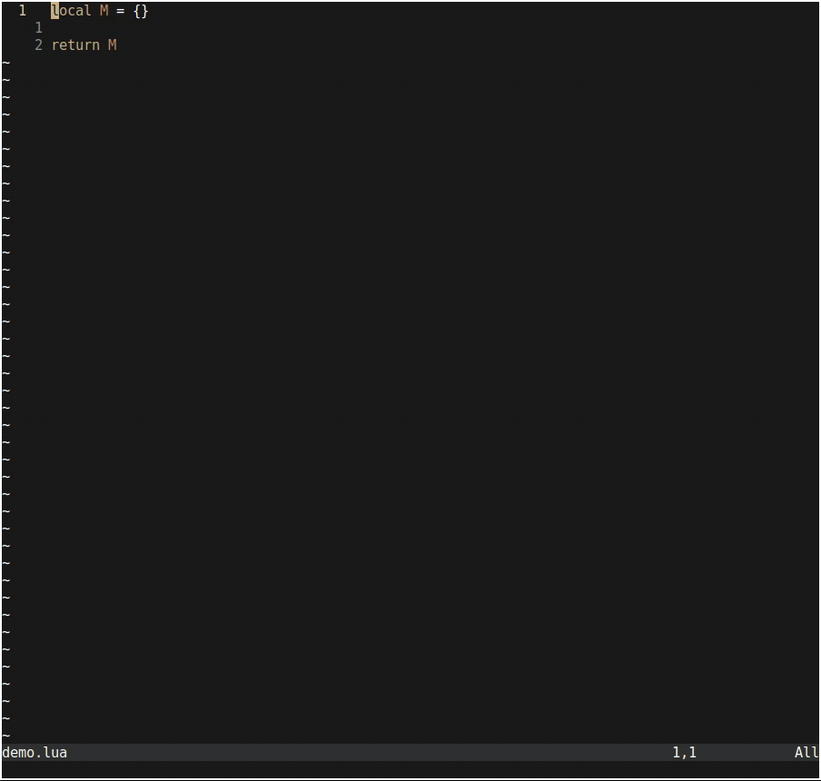

# Neoagent

A small, hackable LLM and coding-agent toolkit for Neovim.






## Features

- Stream assistant responses, reasoning, tool calls, usage, and provider status
  directly in Neovim.
- Use Anthropic Messages, OpenAI-compatible Chat Completions and Responses,
  local models with llama.cpp, built-in Anthropic, DeepSeek, and Z.AI
  catalogs, or Claude and ChatGPT subscription authentication.
- Compose Models, tools, executors, Sessions, Controllers, and Views as
  ordinary Lua values with explicit dependencies.
- Run cancellable agent loops with custom tools, steering messages, retry
  handling, and context compaction.
- Use bundled coding tools for file operations, shell commands, and on-demand
  Neoagent documentation.
- Persist conversations with branches, linked forks, labels, model state, and
  context compaction.
- Work from a floating Markdown UI with separate transcript and input windows.
- Start with **Neo** for coding tasks and **Chat** for tool-free conversation.
- See `:help neoagent` for the complete configuration and API reference.

## Quick configuration

Choose a provider:

- Run `:NeoagentLogin openai` to store an OpenAI API key, or set
  `OPENAI_API_KEY` before starting Neovim.
- Run `:NeoagentLogin anthropic` to store an Anthropic API key, or set
  `ANTHROPIC_API_KEY` before starting Neovim.
- For Claude Pro or Max authentication, run `:NeoagentLogin anthropic-plan`,
  or provide an existing `ANTHROPIC_OAUTH_TOKEN`.
- Run `:NeoagentLogin deepseek` to store a DeepSeek API key, or set
  `DEEPSEEK_API_KEY` before starting Neovim.
- Run `:NeoagentLogin zai` to store a Z.AI API key, or set `ZAI_API_KEY`
  before starting Neovim. The credential enables both the metered API and
  global Coding Plan catalogs.
- For a ChatGPT Plus or Pro subscription, run
  `:NeoagentLogin openai-codex`, complete the browser or device-code login,
  then select a subscription model with `:NeoagentModel`.

API keys are entered through a masked prompt. A stored credential takes
precedence over its environment variable. `:NeoagentLogout [method]` removes
the stored credential and leaves environment variables unchanged. Anthropic
currently bills third-party Claude subscription OAuth requests as extra usage
per token; they do not consume included Claude plan limits.

Configure an OpenAI model and a mapping:

```lua
require("neoagent").setup({
  default_model = {
    provider = "openai",
    model = "gpt-5.4",
  },
})

vim.keymap.set("n", "<leader>a", "<cmd>Neoagent<cr>", {
  desc = "Open Neoagent",
})
```

For Anthropic API-key billing, use `anthropic`; use `anthropic-plan` with
Claude Pro/Max OAuth:

```lua
default_model = {
  provider = "anthropic",
  model = "claude-sonnet-4-6",
}
```

Set `provider = "anthropic-plan"` in the same value for Claude Pro/Max OAuth.

To use DeepSeek by default, replace `default_model` with:

```lua
default_model = {
  provider = "deepseek",
  model = "deepseek-v4-flash",
}
```

For Z.AI, use `zai` for the metered API or `zai-coding-plan` for the global
Coding Plan:

```lua
default_model = {
  provider = "zai-coding-plan",
  model = "glm-5.2",
}
```
